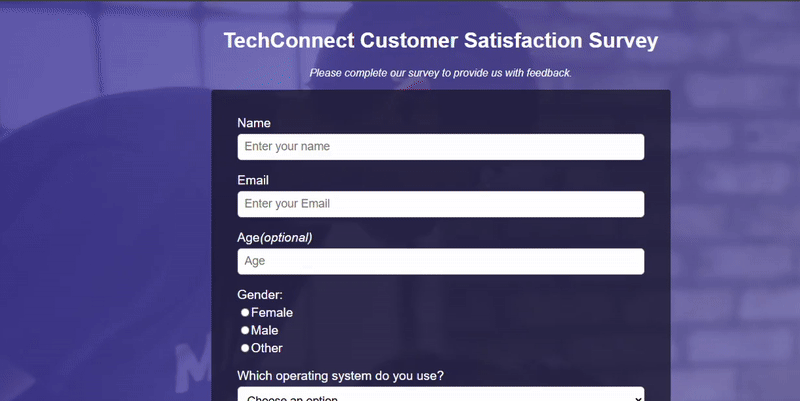

  
  

# Freecodecamp Survey Form Project

---

## 🎯 Purpose

This project is an online survey form designed to learn about the satisfaction levels and usage habits of **TechConnect** customers. Its goal is to develop an application functionally similar to the freeCodeCamp [Survey Form](https://survey-form.freecodecamp.rocks/) project.

---

## 🛠 Technologies Used

- **HTML →** Form structure, tags, and semantic adjustments
- **CSS →** Design, colors, typography, and responsive layout

---

## 📚 What I Learned

- **For, id, class ->**  
  _for_ links a label to the form element with a matching _id_; clicking the label activates the input field. It works like checking a person’s ID number, representing the element to be associated with the label.

  - _id_ is the unique identifier of an element on the page and can only be used once. Like an ID number, it is unique and specific.
  - _class_ is used to group elements; elements with the same class can share common CSS styles. Like a profession group, multiple people can belong to it.

- **Using for and id ->** The relationship between label and input elements is established by assigning _id_ to inputs and using _for_ in labels. This approach is best for accessibility and code readability.

- **Difference between % and rem ->**

  - **% (percentage):** Used to define element sizes relative to the parent element’s size. This provides flexibility in responsive design.
  - **rem (root em):** Sizes are defined relative to the root font-size. This ensures consistent typography and spacing values across the project.

  - Example: The difference between % and rem in CSS can be compared to clothing sizes. Using % is like adjusting clothing size based on the parent’s measurements — if the parent’s size changes, the clothing adjusts proportionally. In contrast, rem is like tailoring clothes with a standard measurement — always based on the root font-size, unaffected by the parent.

- **Responsive design ->** Using media queries to ensure compatibility across devices is one of the core methods of responsive design, enhancing user experience.

- **Background and contrast usage ->** With linear-gradient and opacity values, transparent and aesthetic visuals can be achieved, enhancing the visual appeal of the design.

- **:root usage:** In CSS, global variables can be defined with :root, allowing consistent and easy usage throughout the page.

- **overflow-x: hidden; usage:** Prevents horizontal scrolling, allowing only vertical scrolling and avoiding unwanted horizontal overflow.

- **resize: vertical; usage:** Allows users to resize only vertically, preventing horizontal resizing.

- **position: static; usage:** The default positioning of HTML elements. Elements are positioned according to the normal page flow, and top, left, right, bottom values do not apply.

- **position: relative; usage:** Positions the element relative to its normal flow location, adjustable with top, left, right, bottom. Does not affect other elements.

- **position: absolute; usage:** Positions the element relative to the nearest positioned (relative, absolute, fixed, sticky) ancestor. It is removed from the normal page flow.

- **position: fixed; usage:** Positions the element relative to the viewport. Its position does not change even when the page is scrolled.

- **position: sticky; usage:** Keeps the element in the normal flow until a specified scroll position, then fixes it.

---

## 📷 Screenshot

